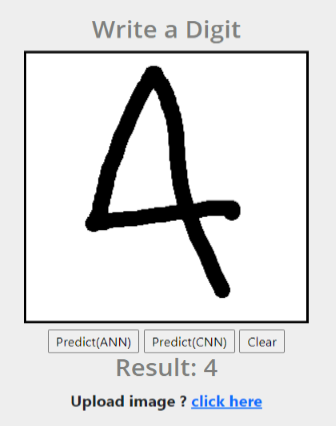

## Hand Written Digit Identifier 

A Django web app to identify hand written Digit using machine learning model and trained over MNIST handwritten digit training dataset and has an accuraccy of more than 98%.<br>

It is implemented using two differnet algorithm ANN and CNN

### ANN Model
<ul>
 <li>Accuracy - 97.6 %</li>
 <li>Implemented from scratch </li>
 <li>No of hidden layers - 1 </li>
</ul>

### CNN Model
<ul>
 <li>Accuracy - 98.3%</li>
 <li>Implemented using Pytorch </li>
 <li> No of layers - 4 </li>
</ul>


Trained weights are stored in ```ANN_params.pkl``` and ```CNN_params.pth.tar``` file.<br>
This web app is deployed on Heroku,  ### [Click Here](https://mlapps.herokuapp.com/digit) to visit the site.

### Screenshots


  

Some observations:<br>
i) Works well when digits are drawn in mid of canvas with full size.<br>
ii) CNN model gives better performance than ANN (as expected). 
