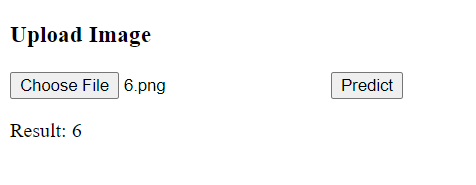

## Hand Written Digit Identifier 

A Django web app to identify hand written Digit using machine learning model and trained over MNIST handwritten digit training dataset and has an accuraccy of more than 98%.<br>

It is implemented using two differnet algorithm ANN and CNN

### ANN Model
<ul>
 <li>Accuracy - 97.6 %</li>
 <li>Implemented from scratch </li>
 <li>No of hidden layers - 1 </li>
</ul>

### CNN Model
<ul>
 <li>Accuracy - 98.3%</li>
 <li>Implemented using Pytorch </li>
 <li> No of layers - 4 </li>
</ul>


Trained weights are stored in ```ANN_params.pkl``` and ```CNN_params.pth.tar``` file.<br>
This web app is deployed on Heroku,  
### [Click Here](https://av1shek-identifyhandwrittendigit.hf.space) to visit the site.


### Screenshots


  

Some observations:<br>
i) Works well when digits are drawn in mid of canvas with full size.<br>
ii) CNN model gives better performance than ANN (as expected). 


<hr/>

## API Endpoints
There is only two endpoints

```
i)  https://av1shek-identifyhandwrittendigit.hf.space/digit/
ii) https://av1shek-identifyhandwrittendigit.hf.space/digit/cnn/
```
Both accepts post request with Base64-encoded data along with Data-URL declaration of image and returns a single digit integer (label of image) as a response.

### How to use these APIs ?
#### Syntax
```Javascript
fetch('https://av1shek-identifyhandwrittendigit.hf.space/digit/cnn/', {
    method: 'POST', 
    headers: { 'Content-Type': 'application/json', },
    body: imgData, // Base64-encoded image data
}).then(response => response.json())
.then(data => { console.log(data); })
.catch(error => { console.log(error); }) 
```

#### Implementation
```HTML
<!DOCTYPE html>
<html>
<head>
    <title>Handwritten Digit Recognition</title>
</head>
<body>
    <h3 class="">Upload Image</h1>
    <input type="file" name="picture" id="picture" />
    <input type="button" class="myButton" id="btn" value="Predict">
    <p id="result"></p>
</body>

<script>
    const fileInput = document.querySelector("input");
    const btn = document.getElementById('btn');
    const result = document.getElementById('result');

    let imgData;
    fileInput.addEventListener("change", ()=> {
        file = fileInput.files[0];
        const reader = new FileReader();
        reader.onloadend = () => { imgData = reader.result; };
        reader.readAsDataURL(file);
    });
    
    btn.addEventListener('click', () => {
        result.innerText = '  Predicting...';
        // CNN URL - https://av1shek-identifyhandwrittendigit.hf.space/digit/cnn/
        // ANN URL - https://av1shek-identifyhandwrittendigit.hf.space/digit/
        fetch('https://av1shek-identifyhandwrittendigit.hf.space/digit/cnn/', {
            method: 'POST', 
            headers: { 'Content-Type': 'application/json', },
            body: imgData,
        }).then(response => response.json())
        .then(data => { result.innerText = 'Result: ' + data; })
        .catch(error => { console.log(error) }) ;
    });
</script>
</html>
```
#### HTML Page
Page will look like this, adding some CSS will make attractive<br/>
